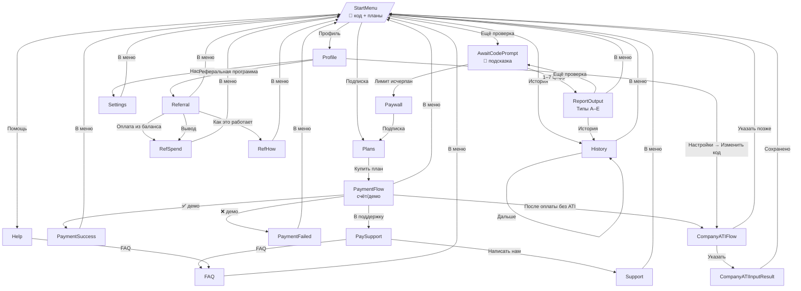

## Карта экранов и пользовательских сценариев

### Таблица потоков

| Состояние | Триггер | Текст бота | Кнопки | Переходы | Ошибки/Edge | Примечания |
| --- | --- | --- | --- | --- | --- | --- |
| `StartMenu` | Команда `/start`; callback `m:menu`; восстановление из сторонних состояний | 🔎 Пришлите код АТИ (до 7 цифр) — ответим сразу.  Доступные планы: • 20 проверок — 299 ₽/мес • 50 проверок — 469 ₽/мес • Безлимит — 799 ₽/мес (до 50 в сутки) | `Ещё проверка`; `Подписка`; `История`; `Профиль`; `Помощь` | `Ещё проверка` → `AwaitCodePrompt`; `Подписка` → `PlansMenu`; `История` → `History`; `Профиль` → `Profile`; `Помощь` → `Help` | Исключения из `dal.ensure_user` и `FreeService.ensure_pack` логируются, интерфейс не меняется | Первый запуск выдаёт бесплатный пакет (5 проверок на 72 часа) через `FreeService.ensure_pack` |
| `AwaitCodePrompt` | Callback `chk:new`; кнопка `Ещё проверка` из отчёта; любое сообщение, не содержащее 1–7 цифр | 🔎 Пришлите код АТИ (до 7 цифр) — ответим сразу. | `Ещё проверка`; `Подписка`; `История`; `Профиль`; `Помощь` | Ввод `^\d{1,7}$` → `ReportOutput`; `Подписка` → `PlansMenu`; `История` → `History`; `Профиль` → `Profile`; `Помощь` → `Help` | — | Используется и для возврата к проверкам после отчёта; клавиатура `kb_main()` |
| `ChecksUnavailable` | Попытка проверки до инициализации `CheckerService` (`_runtime.checker is None`) | Сервис проверок сейчас недоступен. Попробуйте чуть позже. | `Ещё проверка`; `Подписка`; `История`; `Профиль`; `Помощь` | Кнопки ведут как в `StartMenu` | — | Сообщение отправляется единоразово, пока сервис не проинициализирован |
| `ReportOutput` | Пользователь ввёл корректный код, проверка прошла успешно | Тип A — положительный отчёт: 🟢 Код АТИ {ati} успешно прошёл проверку.  📈 Индекс перевозчика: {lin} 📈 Индекс экспедитора: {exp}  🛡 Чёрные списки: риск не выявлен  Перевозка и экспедиция подтверждены. Используйте эти показатели для оценки надёжности.  Тип B — повышенный риск: 🟡 Код АТИ {ati} обнаружен в нашем реестре проверок.  📈 Индекс перевозчика: {lin} 📈 Индекс экспедитора: {exp}  🛡 Чёрные списки: ⁉️ Повышенный риск  По данным нашей аналитики, есть риски. Оценка субъективна и может быть изменена при появлении благоприятных признаков.  Тип C — нейтральный: 🟡 Код АТИ {ati} проверен.  📈 Индекс перевозчика: {lin} 📈 Индекс экспедитора: {exp}  🛡 Чёрные списки: не выявлен риск  Подтверждений по реестрам мало — это не негатив, но истории нет.  Тип D — критический риск: 🔴 Код АТИ {ati} не прошёл проверку.  📈 Индекс перевозчика: {lin} 📈 Индекс экспедитора: {exp}  🛡 Чёрные списки: ⛔️ Критический риск  По данным нашей аналитики, есть риски. Оценка субъективна и может быть изменена при появлении благоприятных признаков.  Тип E — нет данных: 🟡 Код АТИ {ati} не обнаружен в наших реестрах.  📈 Индекс перевозчика: 0 📈 Индекс экспедитора: 0  🛡 Чёрные списки: не выявлен риск  Подтверждений по реестрам не обнаружено — это не негатив, но истории нет. | `Ещё проверка`; `История`; `В меню` | `Ещё проверка` → `AwaitCodePrompt`; `История` → `History`; `В меню` → `StartMenu` | Ошибка записи истории (`dal.append_history`) логируется, отчёт всё равно выводится | Ответ строится через `kb_after_report()`; tail для типа A может меняться в зависимости от индексов |
| `ReportError` | Исключение при проверке (ошибка сервиса или нормализации) | Не удалось выполнить проверку. Попробуйте ещё раз. | `Ещё проверка`; `Подписка`; `История`; `Профиль`; `Помощь` | Как в `StartMenu` | Ошибки логируются, текст не раскрывает деталей | Используется также, если Telegram не передал `from_user` |
| `Paywall` | Бесплатные и платные лимиты исчерпаны (`subs.can_consume` / `free.can_consume` вернули `False`) | Проверок не осталось.  Доступные планы: • 20 проверок — 299 ₽/мес • 50 проверок — 469 ₽/мес • Безлимит — 799 ₽/мес (до 50 в сутки) | `Ещё проверка`; `Подписка`; `История`; `Профиль`; `Помощь` | `Подписка` → `PlansMenu`; остальные кнопки как в `StartMenu` | — | Сообщение `paywall_no_checks()` всегда добавляет актуальный список планов |
| `PlansMenu` | Кнопка `Подписка`; callback `pay:choose`; возврат из поддержки | Доступные планы: • 20 проверок — 299 ₽/мес • 50 проверок — 469 ₽/мес • Безлимит — 799 ₽/мес (до 50 в сутки) | Prod: `Купить 20`; `Купить 50`; `Купить Безлимит`; `В поддержку`; `В меню` Sandbox: `Купить 20`; `Купить 50`; `Купить Безлимит`; `В меню` | `Купить *` → `PaymentFlow`; `В поддержку` → `PaySupport`; `В меню` → `StartMenu` | — | Выбор клавиатуры зависит от `PAYMENTS_ACTIVE_PROVIDER` |
| `PaymentFlow` | Callback `pl:buy:*`; демо-оплата `pay:sbox:*` | Шаг создания счёта: Готовим счёт… Сейчас откроется окно оплаты. Если не открылось — воспользуйтесь кнопками ниже.  Оплачивая, вы принимаете <a href="https://telegra.ph/POLZOVATELSKOE-SOGLAShENIE-USLOVIYa-SERVISA-11-05">Условия сервиса</a> и <a href="https://telegra.ph/Publichnaya-oferta-na-okazanie-uslug-11-05">Оферту</a>. <a href="https://telegra.ph/POLITIKA-KONFIDENCIALNOSTI-11-05-47">Политика конфиденциальности</a>. <a href="https://telegra.ph/PRAVOVOE-UVEDOMLENIE-O-HARAKTERE-SVEDENIJ-I-PORYADKE-OSPARIVANIYa-11-05">Правовое уведомление</a>. <a href="https://telegra.ph/Kontakty-i-rekvizity-11-05">Контакты и реквизиты</a>.  Sandbox-инициация: Оплата (демо)  Оплачивая, вы принимаете … (тот же блок условий).  Демонстрационный режим оплаты: списаний не будет. Для завершения теста выберите «Оплата прошла (демо)» или «Оплата не прошла (демо)».  Заказ создан. Для теста подтвердите или отмените оплату.  Подтверждение (демо): ✅ Оплата подтверждена (демо). Доступ активирован.  Отмена (демо): ❌ Оплата отклонена (демо). Попробуйте снова. | Для шага создания счёта: `Повторить оплату`; `Выбрать другой план`; `В поддержку` Для sandbox checkout: `✅ Оплата прошла (демо)`; `❌ Оплата не прошла (демо)`; `В меню` После подтверждения/отмены: `В меню` | `Повторить оплату` → повторный toast «Повторяем…»; `Выбрать другой план` → `PlansMenu`; `В поддержку` → `PaySupport`; `✅` → `PaymentSuccess`; `❌` → `PaymentFailed`; `В меню` → `StartMenu` | Ошибки: toast «Повторяем…»; «Не удалось создать заказ.» без пользователя; «Неизвестный план.» при неверном коде; «Не удалось подтвердить оплату: {reason}» и «Не удалось отменить оплату: {reason}» при проблемах симуляции | После успешной оплаты добавляется сводка подписки (например «Действует до 15.12.2025\nОсталось проверок: 20») и при отсутствии кода компании — блок `company_ati_ask()` |
| `PaymentSuccess` | Callback `pay:sbox:ok:*`; обновлённый статус подписки | ✅ Оплата подтверждена (демо). Доступ активирован.  Пример статуса: Действует до 15.12.2025 Осталось проверок: 20  + опционально: Оплата прошла ✔  Укажите код АТИ вашей компании (до 7 цифр). Это нужно один раз, чтобы ускорить поддержку. | `В меню` | `В меню` → `StartMenu` | Если симуляция не нашла платёж — сообщение «Не удалось подтвердить оплату: {reason}» | В проде вместо демо-сообщения приходит `texts.payment_success(...)` |
| `PaymentFailed` | Callback `pay:sbox:fail:*` | ❌ Оплата отклонена (демо). Попробуйте снова. | `В меню` | `В меню` → `StartMenu` | Ошибка симуляции даёт текст «Не удалось отменить оплату: {reason}» | — |
| `PaySupport` | Callback `pay:support`; `sup:contact`; `sup:faq` | Экран помощи по оплате: «Нужна помощь по оплате?»  Ответ поддержки: «Если остались вопросы — напишите нам.» | `Написать нам`; `FAQ`; затем `В меню` | `Написать нам` → toast «Открываем чат поддержки…» + сообщение `support_pretext`; `FAQ` → `FAQ`; `В меню` → `StartMenu` | — | Мини-клавиатура `kb_support_minimal()` без кнопки «В меню» |
| `History` | Callback `m:history`; `hist:more:*` | Пустая история: «Пока нет действий.\nПришлите код АТИ (до 7 цифр) — проверим сразу.»  С данными (пример): История действий 🟢 1234567 • 31.10.2025 12:00 💳 Безлимит (799 ₽) • 30.10.2025 14:15 | При данных: `Дальше` (если есть ещё); `В меню` При пустой: `В меню` | `Дальше` → следующая страница; `В меню` → `StartMenu` | По окончании списка выводится алерт «Это всё на сейчас.» | Формат времени — UTC, приводится к `Europe/Moscow` при форматировании |
| `Help` | Callback `m:help`; `sup:faq` | «Помощь»  FAQ: Вопросы и ответы: • Как сделать проверку? — Пришлите код АТИ (до 7 цифр) в чат, и мы сразу дадим отчёт. • Что делать, если проверок не осталось? — Выберите и оплатите план. Всё занимает минуту. • Какие планы доступны? — 20 проверок — 299 ₽; 50 проверок — 469 ₽; Безлимит — 799 ₽ (до 50 в сутки). • Как работают бесплатные проверки? — Новым пользователям выдаётся 5 проверок на 3 дня. • Как работает безлимит? — До 50 проверок в сутки, счётчик обнуляется в 00:00 (Europe/Moscow). • Как оплатить из баланса? — Это возможно только в разделе «Пригласить и заработать». • Как изменить код АТИ компании? — Профиль → Настройки. | На экране помощи: `FAQ`; `Написать нам`; `В меню` В FAQ: `В меню` | `FAQ` → тот же экран с текстом выше; `Написать нам` → `PaySupport`; `В меню` → `StartMenu` | — | Значения для бесплатного пакета и лимитов берутся из `cfg` |
| `Profile` | Callback `m:profile`; `m:settings` | Экран профиля: «Профиль».  Настройки: Настройки Уведомления об оплате: ✅ Уведомления о рефералах: ✅ Скрывать историю: ❌ После отчёта: снова: ✅ После отчёта: меню: ❌ | Профиль: `Настройки`; `Реферальная программа`; `В меню` Настройки: `Уведомления об оплате: ✅/❌`; `Уведомления о рефералах: ✅/❌`; `Скрывать историю: ✅/❌`; `После отчёта: снова`; `После отчёта: меню`; `В меню` | Тогглы меняют состояние внутри `Settings`; `В меню` → `StartMenu`; `Реферальная программа` → `Referral` | — | Значения переключателей берутся из FSM и отображаются эмодзи галочки/крестика |
| `Referral` | Callback `m:ref`; `ref:link`; `ref:copy`; `ref:share` | Пригласить и заработать  Ваша ссылка: https://t.me/your_bot?start=ref_ABC  Скопируйте и отправьте друзьям.  Ваш уровень: 1 • Вознаграждение: 10% До следующего уровня осталось: 3 оплаты  Зачислено: 0 ₽ • Ожидает: 0 ₽  Куда потратить: — Купить 20 из баланса — Купить 50 из баланса — Купить Безлимит из баланса  Вывод средств  Как это работает: • Делитесь вашей ссылкой. • Друг оплачивает подписку. • Мы начисляем % на ваш баланс (доступно через 3 дн.). • Процент растёт по мере количества оплат ваших приглашённых.  Уровни: • 0–2 оплат — 10% • 3–9 — 20% • 10–24 — 30% • 25–49 — 40% • ≥50 — 50%  Оплата из баланса доступна только в разделе «Пригласить и заработать». | `Моя ссылка`; `Скопировать`; `Поделиться`; (`Купить из баланса`*, если доступно); `Вывод`*; `Как это работает`; `В меню` | `Моя ссылка`/`Скопировать`/`Поделиться` → toast «Готово.»; `Купить из баланса` → `ReferralSpend`; `Вывод` → `ReferralPayout`; `Как это работает` → `ReferralHow`; `В меню` → `StartMenu` | При недоступных действиях кнопки `Купить…` и `Вывод` не показываются | Представленные числовые значения — текущие заглушки; реальные данные подтянутся после интеграции DAL |
| `ReferralSpend` | Callback `ref:spend:*`; `ref:withdraw`; `ref:how` | «Оплата из баланса доступна только в разделе «Пригласить и заработать».»  Пояснение программы (при `ref:how`): Как это работает: • Делитесь вашей ссылкой. • Друг оплачивает подписку. • Мы начисляем % на ваш баланс (доступно через 3 дн.). • Процент растёт по мере количества оплат ваших приглашённых. | `В меню` | `В меню` → `StartMenu` | На `ref:withdraw` показывается toast «Заявка создана.» без изменения текста | — |
| `CompanyATIFlow` | Callback `ati:set`; `ati:why`; `ati:later`; `ati:change`; message при ожидании кода; callback `ati:check` | Запрос данных: «Оплата прошла ✔  Укажите код АТИ вашей компании (до 7 цифр). Это нужно один раз, чтобы ускорить поддержку.»  Почему спрашиваем: «Чтобы быстрее помогать вам по вопросам компании и подписки. Код АТИ видим только мы. Вы можете изменить его в настройках в любой момент.»  Отложить: «Хорошо, напомним позже. Указать можно в Профиль → Настройки.»  Смена: «Укажите новый код АТИ (до 7 цифр).»  Проверить этот код: повторно выводится подсказка «🔎 Пришлите код АТИ (до 7 цифр) — ответим сразу.» с клавиатурой после отчёта. | На запрос/смену: `Почему спрашиваем?`; `Указать позже` После сохранения: `Изменить код`; `Проверить этот код`; `В меню` После откладывания: `В меню` | `Почему спрашиваем?` → объяснение; `Указать позже` → сообщение о переносе; `Изменить код` → повтор ввода; `Проверить этот код` → `AwaitCodePrompt`; `В меню` → `StartMenu` | Callback `ati:later` показывает toast «Ок»; `ati:check` использует клавиатуру `kb_after_report()` | После успешной оплаты без указанного кода блок `company_ati_ask()` добавляется автоматически |
| `CompanyATIInputResult` | Ввод кода в FSM `CompanyATIStates.waiting_code` | Неверный ввод: «Нужно до 7 цифр. Попробуйте ещё раз.» Не удалось определить пользователя: «Не удалось сохранить код. Попробуйте ещё раз.» Ошибка БД: «Не удалось сохранить код. Попробуйте ещё раз позже.» Успех: «Готово, код АТИ компании сохранён: {код}. Изменить можно в Профиль → Настройки.» | При ошибке — без клавиатуры; при успехе: `Изменить код`; `Проверить этот код`; `В меню` | Успешное сохранение → FSM очищается; `Проверить этот код` → `AwaitCodePrompt` | Исключения логируются | — |

### Диаграмма состояний

